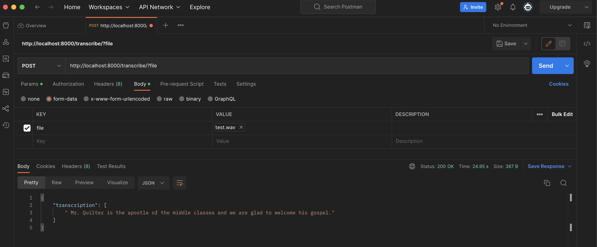

### Whisper service

### Development

#### Setup

1. Add `.env.dev` in `backend/env/`
2. Build and run

Change directory back to `backend/` and then:

```bash
docker-compose build
docker-compose up
```

3. Postman to send a test audio file
- POST to `localhost:8080/transcribe/`. The trailing slash is required.
- Select Body
- Select form-data
- Under key, select file from the dropdown menu
- Under value, select the `test.wav` file under `gpt4-weekend/backend/tests/`
- Press, send

